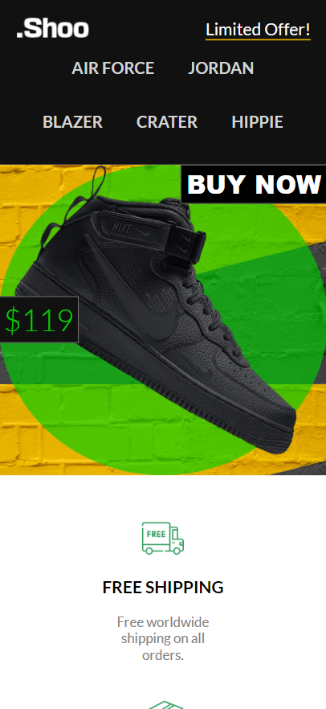

🏬 Shoo Store – E-commerce Web Application

Shoo Store is a single-page e-commerce application built to showcase a modern shoe store. It provides a smooth shopping experience with features like user authentication (sign up & log in), a product catalog, and buying options.

The project is designed to be fully responsive, ensuring a seamless user experience across desktop and mobile devices.

✨ Features

🖥️ Single Page Application (SPA) – Fast and dynamic navigation without page reloads

👤 User Authentication – Sign up, log in, and manage user sessions

👟 Product Showcase – Browse through a collection of shoes with detailed views

🛒 Buying Options – Add to cart, manage items, and simulate checkout flow

📱 Responsive Design – Optimized for both desktop and mobile screens

⚡ Clean UI – Built with modern design principles for a sleek look

🛠️ Tech Stack

Frontend: HTML, CSS, JavaScript

Architecture: Single Page Application (SPA)

Future Scope (optional if you want to mention): MERN stack upgrade with database integration & payment gateway

## ✨ How It Looks:

### Desktop ⬇️

### Mobile ⬇️

